# SpaceRat V2
This is a fork of [KikiHobbyRepair's open-source Spacemouse "SpaceRat"](https://github.com/KikiHobbyRepair/SpaceRat).  
Link to his original video: https://youtu.be/68EapQbDBOc  
If you find his work useful and valuable, you can support his channel on the following link: https://www.buymeacoffee.com/kikihobbyrepair (I am not affiliated in any way).

# PTZ-Version "SpaceBat"
The modifications in this branch are tailored specifically towards controlling the pan-tilt-zoom-camera at [our local church](https://www.youtube.com/@JE5U5_LEBT).  
If you find these useful and valuable, consider building one for *your* local church or supporting the same in less creative ways.  

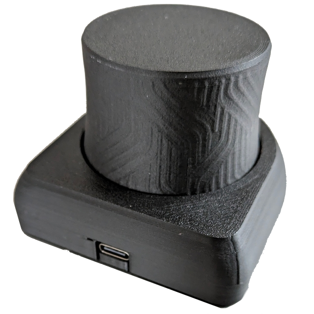  

We use a camera-model by [ptzoptics](https://ptzoptics.com/), but other similar products seem to use the exact same protocol based on Sony's "visca over IP", or a derived version that should work with minor changes (headers, camera-ID, max values etc.).  
The individual modifications described below were done with compatibility towards the original SpaceRat V2 in mind (where possible), so that you could pick the ones that fit your project.
<details>
<summary>
Modifications with respect to original
</summary>

## MCU
To control the camera over WiFi, this version uses the very compact but powerful whilst still dirt cheap [m5stamp s3-module](https://shop.m5stack.com/products/m5stamp-esp32s3-module).  
It is available in different options regarding headers etc.

>[!NOTE]
>If you opt for the version with headers, you might need to increase the height of the cover and the length of the flexible part. If the mcu is mounted **without** its plastic cover, the current version can still work with limited working range. As we are controlling the camera *speeds* and the protocol sets those in steps of 1 and goes from 0 to 20 at most, the remaining resolution of the joystick is plenty enough for the task, though.

## Controls
### Hardware Controls
The hardware-controls were reduced to the pan, tilt and zoom-operations (via rotation of the main joystick) only.  
The hall sensor and the button on top had to be removed.  
The M5stamp used in this version features a hardware button that can be reached through the base. It is not accessible when mounted in the closet though, and therefore currently not implemented on the software side.  
Power is supplied via the USB-c-connector that extends through the housing. We use a charging-cable that features an on/off switch. which can be used to quickly reset the device, and also to prevent unintentional movement of the Camera.

### Software Control
Apart from sending the Visca-controls straight to the camera via udp, the esp serves a web-page that can be used to set the relevant parameters, but also to trigger additional functions (recenter, software-reset etc.) or lock/invert/swap axis.  
The builtin LED of the MCU is used to visualize the current state of calibration and connection to both the network and the camera.
A future version could feature an indirect RGB-ring hidden inside, which could be used for a visual representation of the input state.

#### Connection
Add a file ``ArduinoCode/credentials.h`` containing the credentials necessary to connect the spaceBat to your WiFi-network.
<details>
<summary>example</summary>

```c
// Replace with your WiFi credentials
 const char* ssid = "SSID";
 const char* password = "PASSWORD";
```
  

</details>  

When connected to a PC via serial, it will print out its assigned IP-Address, where you can reach the config-page in a web-browser.
> [!TIP]
> most systems should allow finding the spaceBat via its mDNS-name "PTZ_joystick", so you don't *need* to connect via serial after the inital software-upload at all
#### Configuration
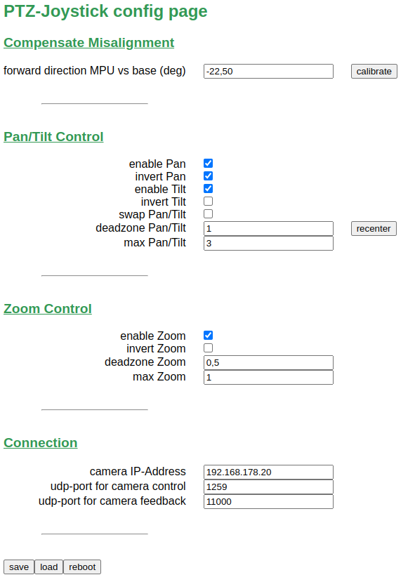

The angle between Mpu and base should be calibrated once before the first use. To do so, press the "calibrate"-button and follow the instructions in the browser, holding the joystick in what should be considered "tilt" direction (up/down can be inverted later on using the respective toggles). Confirm while keeping the joystick tilted.  
"Recenter" is used to get the zero-position of the mpu, and is therefore calculated automatically during the startup-sequence. The button is just an additional software option apart from hardware-reset (via power-supply, the board doesn't feature a reset button) or software-reset of the whole device using the reboot-button.
The boolean toggles should be self-explanatory. Make sure, all the axis you want to use in your project are enabled.  
"Deadzone" and "Max"-Values are the raw-values provided by the mpu-library which are remapped to the minimal and maximal visca-speeds. The deadzones have to be high enough not to activate during control of the other directions. The max values should represent the force needed to reach the highest movement speed possible. In our use case we focus on the finer movements and usually do not need the faster camera speeds. To achieve a more precise control while limiting the maximum speed for manual control below the actual limit set in the camera, we set the "max" value quite a bit *above* the maximum value we achieve during normal operation. 
> [!NOTE] 
> This does not set or respect the movement-limits configured on the camera-side. If you set movement-limits there, check how your individual camera handles values exceeding these limits.  
"Optimal" values used for deadzone and max are highly dependent on your hardware and personal preference. To get a feeling and to further adjust, enable individual axis and check out the visualization tools in the following paragraph
#### Visualization
To visualize the data sent to the camera, the recommended tool is [Serial Studio](https://github.com/Serial-Studio/Serial-Studio)  
We can use its udp-parsing capabilities to visualize the raw visca-format that would be sent to the camera, without touching the actual joystick-output:
- On the spaceBat-config-page, assign the IP-Address of your PC as "camera-address".  
- In Serial Studio use the following connection-settings (using said address, obviously):

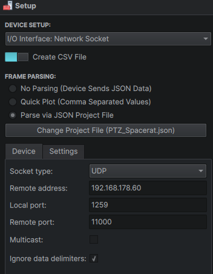 
- If you hit connect, you should see the raw data coming in in the console window already.
- Use the `SpaceBat.json`-Projectfile provided in the 'Extras'-folder to get a nice graphic representation
    - As we cannot use the delimiter-approach in that project, we have to use a custom frame parser to extract the relevant bytes
    - you can enable/disable your preferred visualization-style
    - The individual/combined plot views are comparable to the familiar view in arduino-ide and similar programs
    - An "Accelerometer-gauge" is (mis-)used for a 2D-representation of pan/tilt. We are visualzing normalized values there, but keep in mind we are currently not normalizing the output towards the camera.
    - "PTZ-View" allows to evaluate the controls in a similar fashion to flying a drone, which fits the character of the movement and helps evaluating the "manouverability" for the current configuration. 

If the RGB-Ring mentioned before is available, those LEDs can be used for the same purpose.
Currently the onboard-LED of the M5stamp is used to get some basic feedback of the connection state. The colors are as follows:
- red: starting up
- dark orange: calibrating
- blue: trying to connect to network
- magenta: network connection succeeded (setup finished, no response from camera yet)
- green: received udp packet from camera (camera connection and command verified)
- orange: received error-message from camera (connection to camera verified, but command cannot be executed)  
  
In case the connecion fails, the colors show the failed step of the setup. The serial output can give more detailed information like the error number of the camera.

## printed Hardware
### general modifications
#### overall height
Overall height had to be reduced for our use case in a confined space. If you need the top button in your project, the top part would have to grow a bit higher to accomodate for it.  

#### printability
Some fillets were removed or replaced by chamfers to allow for easier printing without supports

#### screws
All internal screws are the same size as in the original version.  
No glue in this version due to personal preference.  
I don't like printed pins either, but the original ones were a perfect fit, so I reused them. 
The assembled joystick is meant to be firmly mounted to a table or similar through the bottom of the base with m4 screws and heat-sink inserts.

> [!NOTE]
> Pan and tilt operation should be possible without a fixed position for the base, but yaw-control will be directly affected by the absolute position of the base and thus be suppressed through the config-page, if no fixed mounting is possible.

### individual parts
#### top part
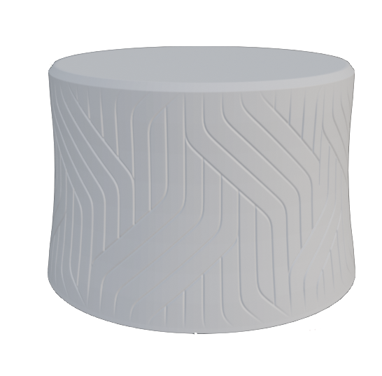
- simplfied due to removed controls (see above)
- reduced in height
- texture adapted from VIK3DESIGN's timeless [ideamaker-design](https://www.ideamaker.io/texture-detail/277-test-lines)   
(for alternatives check out the recently released [HP-library](https://reinvent.hp.com/us-en-3dprint-textures-library);  
for application see the blender-file provided in the 'Extras'-Folder)
#### MPU-carrier
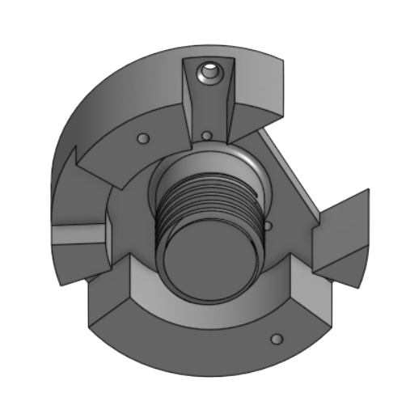
- thread to interface with flexible part
- mpu-position and cutout to allow for jst-connector
- the overall size of the original part happens to be a perfect fit for a standard 12-bit rgb-led-ring.
the extended rim, two extra holes and extra cutout should allow for easy (down-facing) installation
- I couldn't test it yet, but the idea would be indirect lighting through the (maybe increased) gap with the cover for status and positional feedback - or just for show. 
#### flexible part
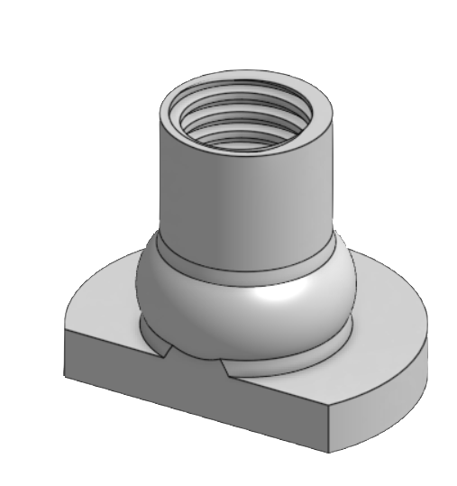
- I couldn't find a suitable spring, so I integrated the threaded connection towards the Mpu-carrier with a flexible element and the original mounting to the base plate
- The current design works great with the hardest TPU of Extrudrs previous range (and probably most filaments of ~95A hardness).  
To compensate for other filament-hardness or personal preference, adjust wall thickness of spherical part only (!).
#### base plate
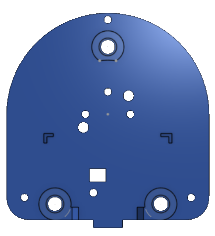
- outer small throughholes connect to cover
- inner small throughholes connect to flexible part (same as original version)
- inner big throughholes are for aligning pins (same as original version)
- markings were for original MCU, which might or might not fit anymore
- lower part takes up M5Stamp (perpendicular orientation)
    - throughhole for the M5's integrated M2-nut
    - rectangular opening to access the integrated button (currently not in use)
- big holes are for [M4 heat-set inserts](https://www.3djake.com/3djake/threaded-inserts-50-piece-set?sai=9420) to mount the assembly from below to a table or similar support
#### cover
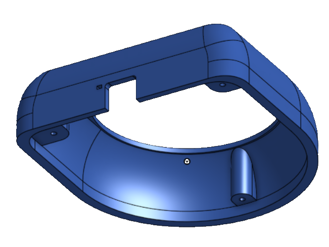
- print upside down without supports (If you have a side mounted auxiliary fan, orient the critical corners accordingly)
- tolerance towards moving part reduced compared to original.  
When using the LED-Ring, the gap might have to be increased again.
- the small hole for the MCU's onboard-LED doesn't look too great on most printers and should usually not be needed, because most usb-c connectors should leak enough light around anyway.
- the position of the hole should fit the M5stamp, when mounted with its included plastic-cover fitted.
### assembly
- solder wires or 4-pin-connector onto mpu-breakout board. Trim to length later and do not connect to mcu before screwing together (obviously)
- mount mpu on carrier
- unlike the original design, I chose not to run the wires through the inside, both for convenience and reduction in height, as well as stability of the upper part (so we can operate with stronger forces).
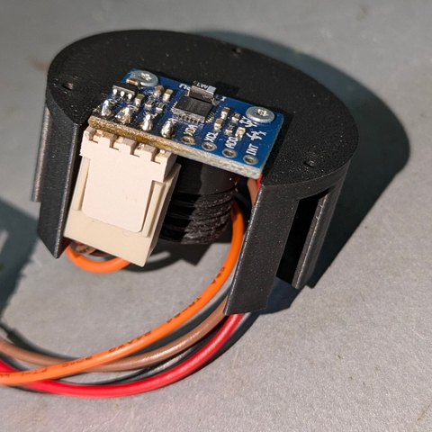  
- mount carrier inside top part
- optional: mount led-ring  
- screw upper subassembly onto flexible part. Tighten well beyond the torque you want to use for zoom operation later. However, there is absolutely no need to overtighten it, trying to reach a perfect alignment. Any 'misalignment' of the Mpu with respect to the base will be compensated for in software.  
- screw flexible part and m5Stamp onto the base plate  
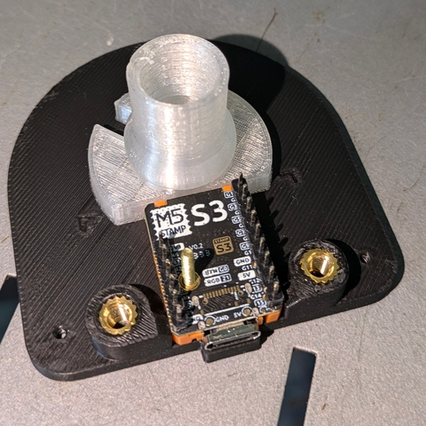  
- cut the wires to length and connect them to the mcu  
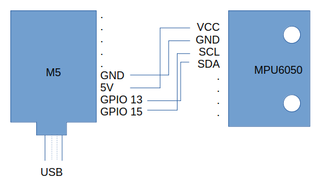  
- add the cover, making sure you don't hurt the wires
## To Do
In its current state, the joystick is fully working and actively used in our services. It definitely is an improvement over controlling the PTZ-camera via the remote control only, especially for minor positional corrections during a live broadcast. But of course, there is still room for improvement:

- As noted above, the "zoom" control via the original hall sensor had to be removed because of limited space in our case.    
If you do not have that limitation, by all means use the original design for zoom functionality.
- As another alternative for when height is not a problem, the `JH-D400X-R1` might be worth a look. This should integrate just fine with the rest of the software-setup and provide even more control without getting too expensive. 
- Using a combination of pan, tilt and zoom at the same time with the current design is possible in theory, but hard to get tuned for reliable operation using the deadzones and max values alone.
- This might be improved using a clever compensation-method if Abs(zoom)>DeadzoneZoom, but for now, we get good results when deactivating zoom in the joystick-cfg and using the original remote control for zoom operation. As the protocol uses separate messages for pan/tilt and zoom, the joystick and the remote control do not interfere but can be used at the same time and still allow for smooth movements when used in this combination.
- The "Software-Recenter"-functionality should be modified so it stops sending commands before resetting. This would be just a minor change, but I do not have access to the device right now.
- The whole thing could be cleaned up. Especially for the http-part I just hacked together something that works. I have no experience nor ambition in web-design.
- Someone should do a version with the downfacing LED-Ring mentioned above, just for the sake of completeness. 
</details>  